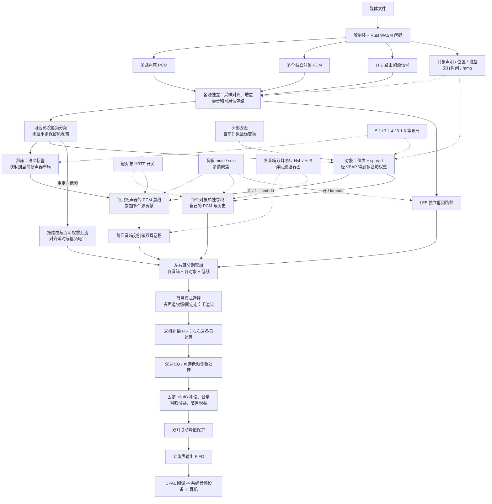
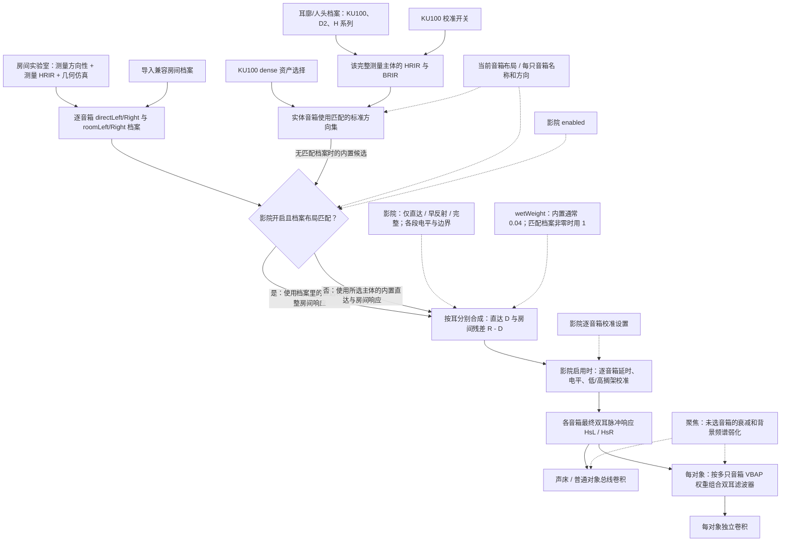
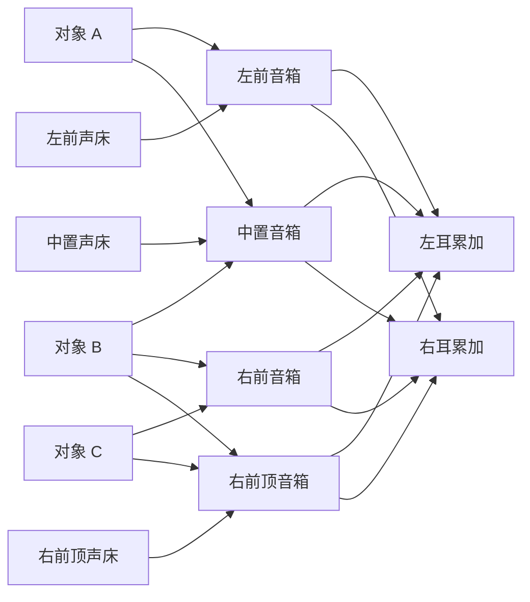
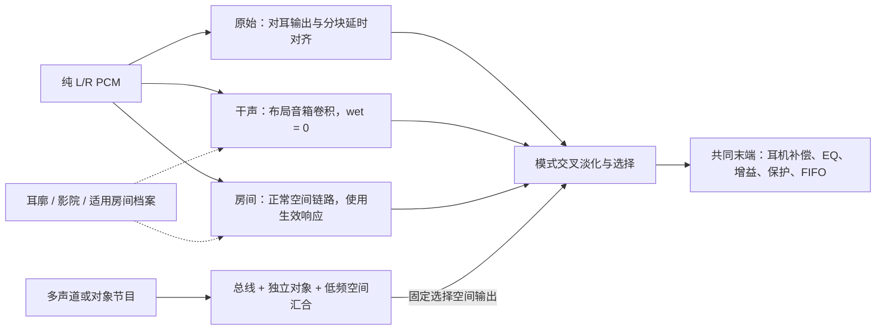

# 双耳渲染计算流程：音频、多对多路由与开关关系

核对日期：2026-09-06。代码基线：`2d2cbc9`。本文描述当前 Electron + Rust 原生发声链路，不是未来设计；仅增加说明，不改变播放算法。

**这套处理不是“裸声 -> 房间 -> 影院 -> 耳廓 -> 对象 HRTF”的串联。** 音源会分流、多个源会汇入同一扬声器，而同一对象可以同时分配给多个扬声器。房间、影院和耳廓共同决定滤波器；这些滤波器同时供声床总线和独立对象使用。

## 1. 先对齐界面名称

| 用户操作 | 实际含义 |
| --- | --- |
| 裸开/只做基础双耳 | 本文指关闭影院附加控制、不启用房间对照、逐对象开关关闭，但仍保留当前 HRTF；不是直接将多声道分到左右耳 |
| KU100 的“取消校准” | 改为读取原始测量 HRIR/BRIR；不是关闭 HRTF，也不关闭影院、耳机 EQ 或输出保护 |
| 打开“房间”面板 | 仅打开实验室。生成档案或播放路径动画，本身不自动更改声音；应用对照才改变音频设置 |
| 房间对照里的“真力虚拟房间” | 应用生成的布局对应双耳房间档案，进入受控对照模式；它使用影院接口，不是另外串一层混响 |
| 开启影院并应用 | 调整直达/早反射/晚反射、每只音箱校准，以及可选低频管理；可使用内置响应或匹配的房间档案 |
| 打开“耳廓”并选择人头 | 选择 KU100、D2 或其他完整测量主体，切换整套 HRIR/BRIR；不是在最终声音上再加一层耳廓 EQ |
| 开启逐对象 HRTF | 对每个对象保留独立卷积历史；仍按当前布局的扬声器响应加权生成该对象的双耳滤波器 |
| 原始立体声 | 仅适用于被识别为纯 L/R 的立体声内容，绕过空间化；不是上面所说的“基础双耳” |

**默认不等于纯干声：** 当前应用通常向原生引擎发送 `wetWeight = 0.04`。关闭影院只关闭影院附加参数，不会自动把内置房间残差权重设为 0。若要比较纯直达，可使用影院“仅直达”；纯立体声另有“干声 HRTF”模式。

## 2. 总图：音频分流与控制的多对多关系

实线表示音频或音频数据的流向，虚线表示元数据、开关控制或滤波系数，不表示再复制一路可听音频。“每个”节点代表一组实例，不是整首歌只运行一个滤波器。



说明：`SPLIT` 的两条上部输出分别代表声床和对象各自的非 LFE 路径，并非把每个源同时当成声床和对象。LFE 提取也受该源的低频路由权重控制。影院低频管理的开启条件是影院启用、bass 开关启用且布局不是 2.0；分频后的高频继续原空间路径，低频送独立汇流。

`lambda` 是对象路径切换包络，不是同时把两份完整对象音量叠加。当前切换按 9,600 个采样渐变，48 kHz 下约 200 ms。声床仍在扬声器总线中，不因逐对象开关改成独立对象。

## 3. 滤波器图：耳廓、房间和影院如何一起生效

这一张是“准备双耳滤波器”的关系图。房间的耳部响应已经在滤波器里，因此不能再画成“房间输出之后额外过一次耳廓 HRTF”。



### 滤波器计算的核心

对某一只音箱、某一只耳朵，`cinema::Settings::mix` 的计算可写成：

```text
H[i] = D[i] * directGain + (R[i] - D[i]) * reflectionGain[i]
```

- `D`：直达响应；`R`：完整房间响应。`R - D` 是代码实际使用的残差；原始测量档案的残差不应被解释成完美分离的纯反射。
- 影院关闭：各段增益为 1、模式视为 Full；内置 `reflectionGain = wetWeight`，通常是 `0.04`。
- 影院开启：按 Direct/Early/Full 模式决定残差，结合早晚反射增益和 10 ms 互补过渡窗，再执行音箱校准。
- 匹配的外部/生成房间档案启用时：非零 wet 被转成 `1`；不会再把同一档案的完整房间一概乘 `0.04`。wet 为 `0` 时仍只取直达部分。
- 档案包含它自身的双耳直达与房间信息。匹配档案生效时，基础响应取自档案，而不是把当前选择的 D2 等人头响应再卷一次；改变耳廓不保证该档案模式下也换掉档案内置的人头。

因此，**“影院 + 房间 + 耳廓”是带选择和优先级的共同输入，不是三段效果简单相乘。**

## 4. 真正的多对多：对象、扬声器与双耳

下图用少量节点展示实际关系类型。连线仅表示可能参与路由，不代表指定歌曲的实时权重，也不代表一个点对象必然同时分配给这里所有音箱。



**一个对象可以贡献给多只音箱；一只音箱可以收到多个对象和声床；一只音箱会通过两条不同的耳部响应同时贡献给两耳。** “右上方”也不是只给右耳发声，而是依靠两耳间的时差、电平差和方向相关频谱产生定位。

开启逐对象 HRTF 后，上图的音箱关系仍保留，但计算顺序改变：

```text
逐对象关闭：
    每只音箱先累加多个源的 PCM
    -> 分别与该音箱的左耳、右耳响应卷积
    -> 累加所有音箱的双耳输出

逐对象开启：
    每个对象先按自己的路由权重组合多只音箱的左耳、右耳响应
    -> 用该对象自己的 PCM 和独立卷积历史计算左右耳
    -> 累加所有对象输出，同时加上声床总线输出
```

忽略切换过渡、低频管理、监听及最终 DSP，设对象 PCM 为 `x_o`，音箱响应为 `H_s,e`，对象到音箱的权重为 `g_o,s`，`*` 为卷积：

```text
普通对象总线贡献： y_e = sum_s [ H_s,e * sum_o(g_o,s * x_o) ]
独立对象贡献：     y_e = sum_o [ (sum_s g_o,s * H_s,e) * x_o ]
```

这是稳定权重条件下的结构表达。固定路由、相同线性滤波时两者可以等价；对象移动、增益变化、分块更新和滤波器过渡时，不能不加条件地交换求和与时变卷积。独立模式的特点是各对象具有自己的滤波状态与过渡，不意味着必然更响或增加原节目没有的位置。

当前原生 `DirectSource::update_focus` 调用的是 `prepared_focus_speaker`：**逐对象 HRTF 不是无视布局，直接按对象方向选一条最近 HRTF。** 同样，不能仅凭 dense 开关名称就宣称当前独立对象会绕过音箱组合、直接使用所有 dense 测量点。

## 5. 各种开启组合会发生什么

| 状态 | 音频主路径 | 滤波数据和额外影响 |
| --- | --- | --- |
| 基础双耳；逐对象关；影院关 | 声床与对象汇入布局音箱，再做双耳卷积 | 当前人头 HRIR/BRIR；通常仍有 0.04 内置残差；没有影院额外音箱校准/低频管理 |
| 基础双耳 + 逐对象 HRTF | 声床继续总线；对象各自组合音箱响应并卷积，最后汇合 | 与总线共享同一套布局/人头/房间滤波来源，切换约 200 ms |
| 更换耳廓；没有生效的外部房间档案 | 总线路径与独立对象路径一起更换响应来源 | 选择完整主体；不是只有对象受影响，也不是末端耳廓 EQ |
| KU100 取消校准 | 路径不变，改用原始测量集 | 增益、延时、左右差异可随原始资产改变；下游其他处理仍存在 |
| 影院开；不选房间档案 | 两条空间路径都使用影院处理后的内置响应 | 直达/反射控制、音箱校准；bass 另按开关影响各源和低频汇流 |
| 影院开 + 匹配房间档案 | 档案响应同时服务总线与独立对象 | 档案基础响应优先；房间已经包含双耳信息，不再叠一次独立耳廓滤波 |
| 房间实验室对照 | 调用同一影院/HRTF/输出增益接口 | 临时切到普通 KU100、关闭 dense、影院中性参数、关闭 bass、选择试听阶段，强制立体声 room 模式；退出恢复保存设置 |
| 房间对照 + 逐对象 HRTF | 对象仍独立，声床仍总线 | 房间对照函数没有替用户关闭逐对象开关；两者可共同作用 |
| 纯立体声选择“原始” | L/R 对应左右耳，绕过空间卷积的可听输出 | 仍经过监听、耳机补偿、EQ、音量/节目增益和峰值保护；不是 bit-perfect |
| 纯立体声选择“干声 HRTF” | 走 wet 为 0 的布局音箱双耳总线 | 影院若开启，其直达增益和校准仍可影响它；并非无条件关闭全部影院处理 |

房间对照里的“原始 KU100 / 校准 KU100 / 真力虚拟房间”不是三个独立可叠加的开关，而是互斥的对照状态。参考电平匹配通过最终对照增益作用于整个输出，不是按对象单独补响度。

影院面板的普通设置需要“应用”才提交。房间对照会临时接管相关参数；显示面板、生成档案、显示声路动画和实际应用处理要分清。

## 6. 纯立体声是另一组并行分支

仅当原生端识别为两路 L/R 声床、没有对象时，原始/干声/房间三个模式才参与选择；多声道与对象节目固定选空间渲染，不受上首立体声所选“原始”模式旁路。



图中原始 L/R 分支保留源信号，不使用影院分频后的高频替代它；干声/房间分支按各自模式使用低频及空间处理。互斥模式之间通过权重淡化，不是把三份完整电平永久叠加。

## 7. 对应代码，方便后续维护

| 图中步骤 | 当前实现 |
| --- | --- |
| 人头选择、校准、逐对象开关、房间对照 | [`App.tsx`](../apps/web/src/App.tsx)：`nativeHrtfSetName`、`applyRoomComparison`、`restoreRoomComparison`、相关 change 回调 |
| 面板与实际应用的区别 | [`RoomLab.tsx`](../apps/web/src/components/RoomLab.tsx)、[`CinemaPanel.tsx`](../apps/web/src/components/CinemaPanel.tsx) |
| 解码、短帧合并与采样事件 | [`decoder.worker.ts`](../packages/player/src/decoder.worker.ts)、[`frame-batcher.ts`](../packages/player/src/frame-batcher.ts)、[`player.ts`](../packages/player/src/player.ts) |
| 源分流、直接/总线交叉淡化、低频和总输出顺序 | [`main.rs`](../apps/native-renderer/src/main.rs)：`Engine::render_into` |
| 普通音箱 PCM 汇合与卷积 | [`bus_renderer.rs`](../apps/native-renderer/src/bus_renderer.rs)：`add`、`shape_background`、`finish_block` |
| 对象自己的多音箱滤波器组合 | [`direct_renderer.rs`](../apps/native-renderer/src/direct_renderer.rs)：`update_focus`、`finish_block` |
| 内置/外部房间响应优先级和双耳滤波准备 | [`hrtf.rs`](../apps/native-renderer/src/hrtf.rs)：`mixed_speaker`、`prepared_focus_speaker` |
| 直达与房间残差、音箱校准、低频分频 | [`cinema.rs`](../apps/native-renderer/src/cinema.rs)：`Settings::mix`、`calibrate`、`BassSplit` |
| 聚焦背景频谱 | [`focus.rs`](../apps/native-renderer/src/focus.rs)：1.5 kHz 低通与保留部分原信号；未选音箱约 -24 dB |
| 耳机补偿与最终输出 | [`headphone.rs`](../apps/native-renderer/src/headphone.rs)、[`dsp.rs`](../apps/native-renderer/src/dsp.rs)、[`callback_output.rs`](../apps/native-renderer/src/callback_output.rs) |

补充说明：[双耳渲染说明](binaural-rendering.md)、[影院房间渲染](cinema-room-rendering.md)、[房间实验室](room-lab.md)、[后端移植调研](backend-portability-research.md)。
